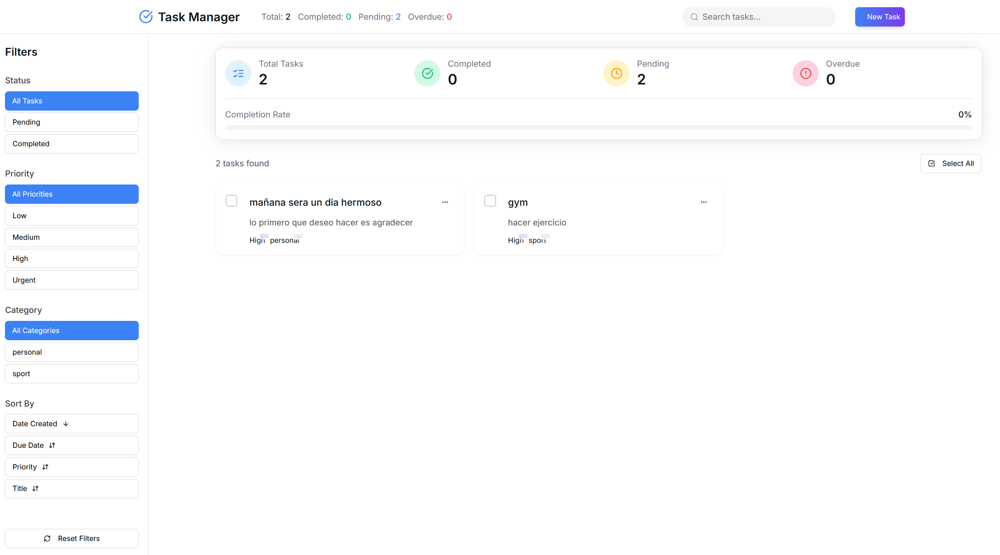

<!--
████████████████████████████████████████████████████████████████████████████████
█                                                                              █
█   ████████  ██████   █████  ███████ ██   ██ ███████ ██    ██  ██████  ██████  █
█      ██    ██   ██ ██   ██ ██      ██   ██ ██      ██    ██ ██    ██ ██   ██ █
█      ██    ██████  ███████ ███████ ███████ █████   ██    ██ ██    ██ ██████  █
█      ██    ██   ██ ██   ██      ██ ██   ██ ██      ██    ██ ██    ██ ██   ██ █
█      ██    ██   ██ ██   ██ ███████ ██   ██ ███████  ██████   ██████  ██   ██ █
█                                                                              █
█                              TaskLucas                                       █
████████████████████████████████████████████████████████████████████████████████
-->

<div align="center">
  
</div>

<div align="center">
  <h2>📑 Índice rápido</h2>
  <ul align="left">
    <li><a href="#presentacion">🕹️ Presentación</a></li>
    <li><a href="#que-es-tasksyato">📦 ¿Qué es TASKsYATO?</a></li>
    <li><a href="#instalacion-rapida">🚀 Instalación Rápida</a></li>
    <li><a href="#acceso">🖥️ Acceso</a></li>
    <li><a href="#caracteristicas-principales">🧩 Características principales</a></li>
    <li><a href="#documentacion-avanzada">📝 Documentación avanzada</a></li>
    <li><a href="#problemas-comunes-y-soluciones">🛠️ Problemas comunes y soluciones</a></li>
    <li><a href="#guia-paso-a-paso-como-tener-tasklucas-funcionando-en-tu-pc-desde-cero">🧑‍💻 Guía paso a paso</a></li>
    <li><a href="#como-subir-tu-proyecto-a-github">📤 ¿Cómo subir tu proyecto a GitHub?</a></li>
    <li><a href="#creditos-y-licencia">👾 Créditos y Licencia</a></li>
  </ul>
</div>

---

#  TaskLucas

>  **Gestor de Tareas CRUD con FastAPI + React**

---

## 🕹️ Presentación

¡Bienvenido a **TASKsYATO**! Una app web de gestión de tareas con estética retro 8-bits, pensada para aprender, practicar y disfrutar la productividad.

<div align="center">
  
</div>

---

## 📦 ¿Qué es TasksLucas-CRUD?

TASKsYATO es una aplicación CRUD de tareas multiplataforma, con backend en FastAPI y frontend en React + TypeScript. Ideal para aprender arquitectura moderna, buenas prácticas y despliegue profesional.

---

## 🚀 Instalación Rápida

### 1. Clona el repositorio
```bash
# Clona el proyecto y entra a la carpeta
 git clone <url-del-repo>
 cd task-crud-app
```

### 2. Backend (FastAPI)
```bash
cd backend
python -m venv venv
# Linux/Mac: source venv/bin/activate
# Windows PowerShell: .\venv\Scripts\Activate.ps1
# Windows CMD: .\venv\Scripts\activate.bat
pip install -r requirements.txt
# (Opcional) Levanta la base de datos con Docker
# docker-compose up -d
# Aplica migraciones
# Linux/Mac: alembic upgrade head
# Windows: python -m alembic upgrade head
# Inicia el servidor
# Linux/Mac: uvicorn app.main:app --reload
# Windows: python -m uvicorn app.main:app --reload
```

### 3. Frontend (React)
```bash
cd ../frontend
npm install
npm run dev
```

---

## 🖥️ Acceso
- Frontend: [http://localhost:3000](http://localhost:3000)
- Backend: [http://localhost:8000/docs](http://localhost:8000/docs) (Swagger UI)

---

## 🧩 Características principales
- CRUD de tareas con filtros, prioridades y categorías.
- Interfaz retro, responsiva y moderna.
- Backend robusto y seguro con FastAPI.
- Documentación interactiva (Swagger/OpenAPI).
- Filtros y estado global con React Context.
- Código limpio, modular y didáctico.

---

## 📝 Documentación avanzada

Para detalles técnicos, estructura, explicación de hooks, componentes y arquitectura, consulta el archivo [`manualTask.md`](./manualTask.md) 📖.

---

## 🛠️ Problemas comunes y soluciones
- **No se reconoce 'source', 'uvicorn', 'alembic', etc.**
  - Usa los comandos correctos según tu sistema operativo (ver ejemplos arriba).
- **Permisos en PowerShell para activar el entorno:**
  - Ejecuta: `Set-ExecutionPolicy -ExecutionPolicy RemoteSigned -Scope CurrentUser`
- **El frontend no conecta con el backend:**
  - Asegúrate de que el backend esté corriendo y revisa la consola del navegador para errores de red o CORS.
- **Error TypeError: doc.getElementById(...) is null en translator.js:**
  - Es causado por una extensión de traducción automática del navegador, no por tu app.

---

## 🧑‍💻 Guía paso a paso: ¿Cómo tener TaskLucas funcionando en tu PC desde cero?

### 1. Requisitos previos
- Tener instalado **Git** ([descargar aquí](https://git-scm.com/downloads))
- Tener instalado **Python 3.10+** ([descargar aquí](https://www.python.org/downloads/))
- Tener instalado **Node.js 18+** ([descargar aquí](https://nodejs.org/))
- (Opcional) Tener **Docker** si quieres usar la base de datos en contenedor ([descargar aquí](https://www.docker.com/products/docker-desktop/))

### 2. Descargar el proyecto
Abre una terminal (PowerShell en Windows) y ejecuta:
```bash
git clone <url-del-repo>
cd task-crud-app
```

### 3. Instalar y preparar el backend (API)
```bash
cd backend
python -m venv venv
# Activa el entorno virtual:
# Windows PowerShell: .\venv\Scripts\Activate.ps1
# Windows CMD: .\venv\Scripts\activate.bat
# Linux/Mac: source venv/bin/activate
pip install -r requirements.txt
```

#### (Opcional) Levantar la base de datos con Docker
```bash
docker-compose up -d
```

#### Aplicar migraciones de la base de datos
```bash
# Windows:
python -m alembic upgrade head
# Linux/Mac:
alembic upgrade head
```

#### Iniciar el backend
```bash
# Windows:
python -m uvicorn app.main:app --reload
# Linux/Mac:
uvicorn app.main:app --reload
```

### 4. Instalar y levantar el frontend (interfaz web)
```bash
cd ../frontend
npm install
npm run dev
```

### 5. Acceder a la aplicación
- Abre tu navegador y entra a: [http://localhost:5173](http://localhost:5173)
- Para ver la documentación de la API: [http://localhost:8000/docs](http://localhost:8000/docs)

---

### 6. ¿Qué hago si algo falla?
- Revisa la sección "🛠️ Problemas comunes y soluciones" más abajo.
- Asegúrate de que tanto el backend como el frontend estén corriendo y sin errores en la terminal.
- Si usas Docker, verifica que el contenedor de la base de datos esté en estado "healthy".
- Si tienes dudas, consulta el archivo `manualTask.md` para detalles técnicos.

---

> ¡Listo! Ya puedes usar TaskLucas en tu PC, crear tareas y disfrutar la experiencia 8-bit.

---

## 📦 ¿Cómo subir este proyecto a tu GitHub?

### 1. Crea tu repositorio en GitHub
- Ve a https://github.com/aramendyLucky/TasksLucas-CRUD (ya creado).

### 2. Conecta tu proyecto local al repositorio remoto
Abre una terminal en la carpeta raíz del proyecto y ejecuta:

```powershell
git init
git add .
git commit -m "Proyecto inicial: TaskLucas CRUD FastAPI + React"
git branch -M main
git remote add origin https://github.com/aramendyLucky/TasksLucas-CRUD.git
git push -u origin main
```

### 3. Para futuros cambios
Cada vez que hagas cambios:
```powershell
git add .
git commit -m "Describe tu cambio"
git push
```

### 4. ¡Listo!
Tu código estará disponible en tu repositorio de GitHub.

---

<style>
  /* Mejora visual para tablas y bloques */
  table {
    border-collapse: collapse;
    width: 100%;
    margin: 1em 0;
  }
  th, td {
    border: 1px solid #ccc;
    padding: 0.5em 1em;
    text-align: left;
  }
  th {
    background: #222;
    color: #fff;
  }
  tr:nth-child(even) {
    background: #f8f8f8;
  }
</style>

## 👾 Créditos y Licencia
- Proyecto creado por [Tu Nombre o Equipo].
- Basado en tecnologías open source.
- Licencia: MIT

---

<div align="center" style="margin-top:2em;">
  
  <br/>
  <b>¡Disfruta gestionando tus tareas con estilo 8-bit!</b>
</div>
